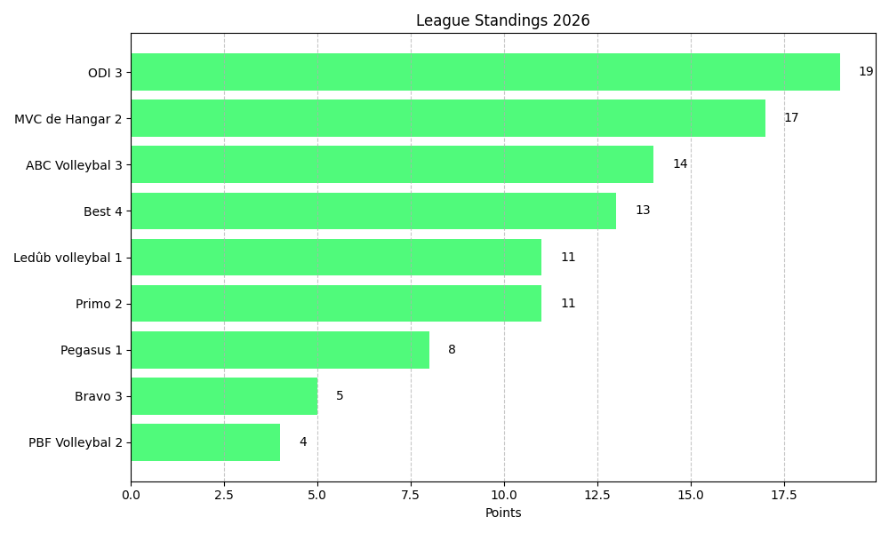

# 🏐 Dutch League Volleyball Analytics

A Python-based ETL pipeline that scrapes, cleans, and visualizes match data for the Dutch Recreational Volleyball Competition (NDRC).

## 🚀 Key Features
* **Scraper:** Automated extraction of match data from legacy HTML tables using `pandas` and `requests`.
* **Data Cleaning:** Custom parsing logic to separate "Match Results" (3-0) from "Set Scores" (25-21, 25-19) into computable integers.
* **Aggregator:** Calculates live league standings based on home/away performance.
* **Visualization:** Generates dynamic bar charts for team rankings using `matplotlib`.

## 🛠 Tech Stack
* **Python 3.14**
* **Pandas** (Data Manipulation)
* **Matplotlib** (Visualization)
* **BeautifulSoup / lxml** (HTML Parsing)

## 📊 Sample Output

## 🔄 How to Run
1. `pip install pandas requests matplotlib lxml`
2. `python scraper.py` (Fetches raw data)
3. `python cleaner.py` (Processes scores)
4. `python visualizer.py` (Generates chart)